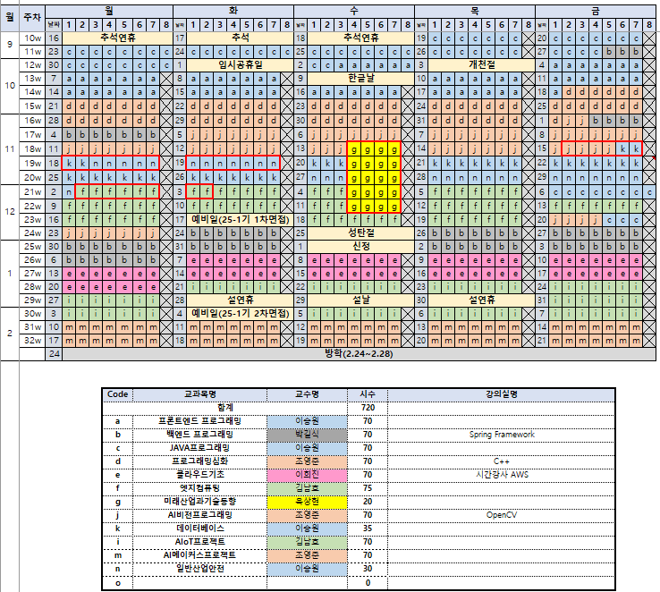

# 백규원의 github 홈페이지
## IT
  파이썬 프로그래밍 프로젝트입니다.
## 전체 설계도
 
## 즐겨찾기
[네이버링크입니다.](https://naver.com> 
## 고양이 동영상
<iframe id="ytplayer" type="text/html" width="640"
height="360" src=https://www.youtube.com/embed/jsRqtnGOavk" frameborder="0"></iframe> 

1. 순서1
2. 순서2
3. 순서3
* 메뉴1
  + 서브메뉴1
    - 서서브 메뉴1

# hello-world
test repository

# markdown language
# title
## sub title
##### 3rd title
- item1
- item2
- item3
